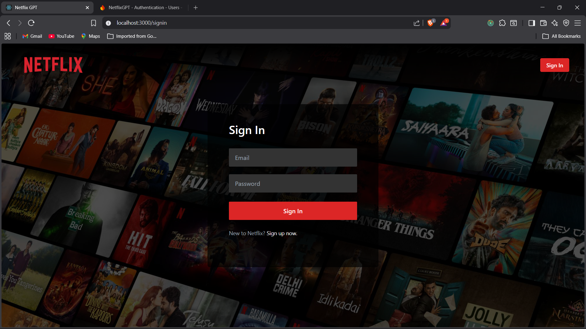

# 🎬 Netflix GPT

Netflix GPT is a Netflix-inspired, AI-powered movie discovery application built using **React**, **Tailwind CSS**, **Firebase**, **Redux Toolkit**, **TMDB API**, and **OpenAI GPT**.

The project focuses on building a real-world scalable frontend application with authentication, protected routing, API integration, state management, and AI-based search functionality.

---

## 🚀 Tech Stack

- **Frontend**: React (Create React App)
- **Styling**: Tailwind CSS
- **State Management**: Redux Toolkit
- **Authentication**: Firebase Authentication
- **APIs**:
  - TMDB API (Movies & trailers)
  - OpenAI GPT (AI-powered search)
- **Deployment**: Firebase Hosting

---

## 🎥 Demo

> 📌 A full working demo video of Netflix GPT is available in the repository or linked externally.

---

## 📸 Screenshots

### 🔐 Authentication

| Sign In | Sign Up |
|--------|---------|
|  |  |

---

### 🎬 Hero Section (Main Container)

---

### ▶️ Trailer Preview

---

### 🎞️ Movie Lists (Secondary Container)

---

### 🤖 GPT Search Feature

---

## 🧩 Application Workflow & Features

### 🔐 Authentication Flow
- Sign Up & Sign In pages
- Form validation
- Firebase authentication setup
- Create user account
- Sign In user API
- Sign Out functionality
- Update user profile
- Protected routes:
  - Redirect unauthenticated users from `/browse` → `/signin`
  - Redirect authenticated users from `/signin` → `/browse`

---

### 🗂️ Project Architecture
- Tailwind CSS configuration
- React Router based navigation
- Centralized constants file
- Redux Store setup with:
  - `userSlice`
  - `movieSlice`
- Multiple custom hooks for clean logic separation

---

### 🎥 Movie Features (TMDB Integration)
- Registered app on TMDB and generated access token
- Fetch **Now Playing Movies**
- Store movie data in Redux
- Fetch trailer video data
- Store trailer data in Redux
- YouTube trailer embed with:
  - Autoplay
  - Mute
- TMDB Image CDN integration

---

### 🎨 UI & UX
- Netflix-style layout
- Responsive design using Tailwind CSS
- Main container with:
  - Background trailer
  - Movie title & description
  - Play & More Info buttons
- Secondary container with:
  - Multiple vertically scrollable movie lists

---

### 🤖 GPT Features
- Dedicated GPT Search Page
- GPT-powered movie recommendations
- AI-based search instead of traditional keyword search
- Multi-language support in the application

---

## 🌍 Deployment

- Production build created using `npm run build`
- Deployed using **Firebase Hosting**
- Environment variables secured
- Optimized for performance

---

## 📚 Learnings & Takeaways

- Real-world Firebase authentication flow
- Redux Toolkit best practices
- Custom hooks for scalable architecture
- API integration & async data handling
- Route protection and session management
- Tailwind CSS for rapid UI development
- Integrating AI features into frontend applications
- End-to-end deployment workflow

---

## 👨‍💻 Author

**Ayush Sahu**  
Frontend Developer | React | Tailwind | Firebase | AI-powered Web Apps

---

⭐ If you like this project, feel free to star the repository!
